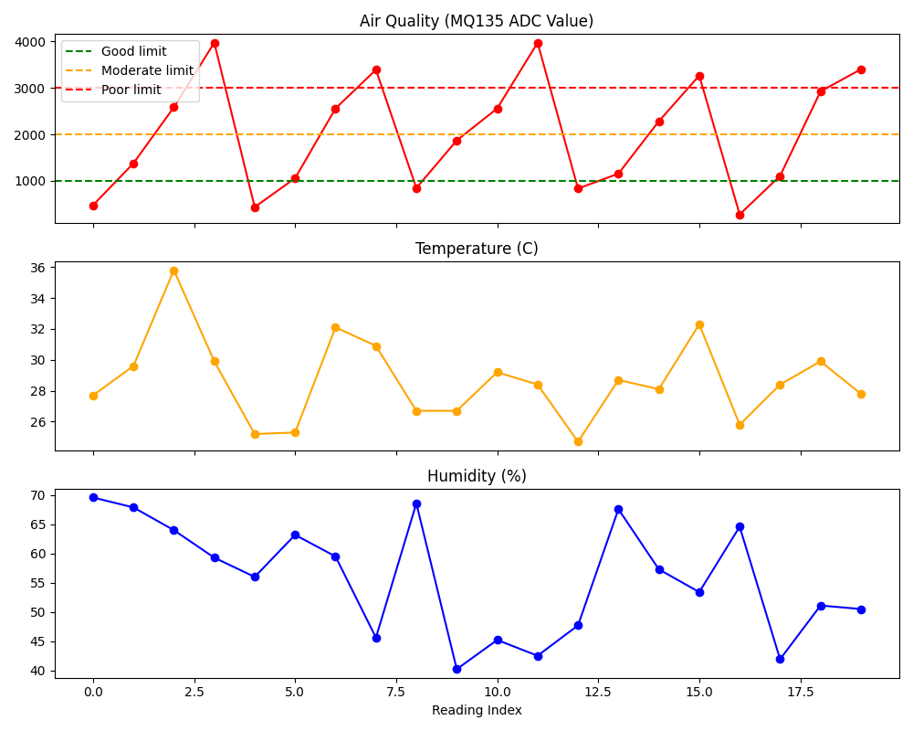

# IoT-Based Air Quality & Pollution Monitoring Dashboard

## 📌 Overview
An IoT system that monitors air quality, temperature, and humidity in real time using an ESP32 microcontroller (or a Python-based virtual simulation for those without hardware). The system classifies pollution levels (Good/Moderate/Poor/Hazardous), triggers local alerts via LED/buzzer, and streams data to a cloud dashboard (ThingSpeak) for visualization and historical analysis.

## ❓ Problem Statement
Air pollution is a major public health concern in cities, schools, hospitals, and industrial areas, but real-time monitoring and alerting systems are often expensive or inaccessible. This project provides a low-cost, scalable, and easily deployable IoT solution to continuously monitor air quality and generate timely alerts — enabling preventive action before pollution levels become hazardous.

## ⚙️ Components Used
| Component | Purpose |
|---|---|
| ESP32 | Main microcontroller, Wi-Fi connectivity, data processing |
| MQ135 Gas Sensor | Detects CO2, ammonia, smoke, and VOCs (air quality) |
| DHT11 Sensor | Measures temperature and humidity |
| Buzzer | Audible alert for hazardous air quality |
| LEDs (Green/Yellow/Red) | Visual status indicator |
| ThingSpeak | Cloud dashboard for data visualization |

*Note: A full Python-based virtual simulation is included for users without physical hardware.*

## 🏗️ Architecture

Air Quality Sensors (MQ135, DHT11)

↓

ESP32 Microcontroller / Python Simulation

↓

Data Processing & AQI Classification

↓

Alert Generation (Buzzer/LED)

↓

Cloud Dashboard (ThingSpeak)

↓

Data Logging & Report Generation

## ✨ Features
- Real-time air quality, temperature, and humidity monitoring
- Automatic pollution classification: Good / Moderate / Poor / Hazardous
- Local alerts via LED indicators and buzzer
- Cloud dashboard integration with live charts (ThingSpeak)
- CSV data logging for historical analysis
- Auto-generated text reports and trend charts
- Hardware-free virtual simulation mode for testing and demos

## 🗂️ Project Structure

IoT-Air-Quality-Pollution-Monitoring-Dashboard/

├── arduino_code/          # ESP32 firmware

├── python_simulation/      # Virtual sensor simulation

├── dashboard/               # ThingSpeak setup guide

├── data/                     # Logged sensor data (CSV)

├── outputs/                  # Generated reports and charts

├── images/                   # Screenshots

├── circuit_diagram/          # Wiring documentation

├── reports/                   # PDF reports (optional)

├── docs/                       # Interview prep

├── main.py                     # Simulation entry point

├── requirements.txt

└── .gitignore

## 🚀 Setup & Installation

### Option 1: Virtual Simulation (No Hardware Required)
```bash
git clone https://github.com/Rakshitha262004/IoT-Air-Quality-Pollution-Monitoring-Dashboard.git
cd IoT-Air-Quality-Pollution-Monitoring-Dashboard
pip install -r requirements.txt
python main.py
```

### Option 2: Real Hardware (ESP32)
1. Open `arduino_code/air_quality_monitor.ino` in Arduino IDE.
2. Install required libraries: `DHT sensor library`, `ESP32 board package`.
3. Update `WIFI_SSID`, `WIFI_PASSWORD`, and `THINGSPEAK_API_KEY` with your credentials.
4. Wire components as described in `circuit_diagram/wiring_diagram.md`.
5. Upload the code to your ESP32.
6. Open Serial Monitor (115200 baud) to view live readings.

## ▶️ Execution
- **Simulation mode**: running `main.py` generates 20 simulated readings cycling through normal, moderate, smoke, and hazardous scenarios, logs them to `data/air_quality_log.csv`, and produces a report and chart in `outputs/`.
- **Hardware mode**: the ESP32 continuously reads live sensor data, displays it on Serial Monitor, drives LED/buzzer alerts, and uploads to ThingSpeak every 16 seconds.

## 📊 Dashboard
The project includes a **Streamlit web dashboard** for local real-time visualization:

```bash
streamlit run dashboard/streamlit_app.py
```

Features:
- Live metrics: AQI value, temperature, humidity, pollution status
- Color-coded alert banners (Good/Moderate/Poor/Hazardous)
- Trend charts for air quality, temperature, and humidity
- Pollution status distribution chart
- Raw data table with CSV download
- Optional auto-refresh

*A ThingSpeak cloud dashboard option is also documented in `dashboard/thingspeak_setup.md` for hardware-based deployments.*

See `dashboard/thingspeak_setup.md` for full setup instructions.

## 📊 Sample Output

[2026-06-12 10:30:00] Scenario: HAZARDOUS

MQ135 Value : 3542

Temperature : 34.2 C

Humidity    : 58.3 %

Air Quality : Hazardous

Alert       : ALERT! HAZARDOUS air quality detected! Take immediate precautions.

## 🖼️ Screenshots

|dashboard|graphs|
|---------|------|
|.png)|.png)|
|.png)|.png)|

## Demo Video 
Link : https://drive.google.com/file/d/1mW9bCgXzCYWvEHgBGM8d9uCVy83FWp-k/view?usp=sharing

## 🔮 Future Improvements
- Add MQ2 sensor for smoke/LPG-specific detection
- Integrate SMS/email alerts via Twilio or IFTTT
- Add OLED display for standalone operation
- Build a mobile app for remote monitoring
- Implement machine learning-based pollution forecasting

## 🎓 Learning Outcomes
- Hands-on experience with IoT sensor integration (ESP32, MQ135, DHT11)
- Understanding of AQI classification and threshold-based alerting
- Cloud dashboard integration (ThingSpeak/HTTP APIs)
- Data logging, CSV handling, and visualization with Python/Matplotlib
- End-to-end IoT project lifecycle: hardware design → simulation → cloud → reporting

## 👤 Author
**Rakshitha A S** | B.E. Cybersecurity

## 📄 License
This project is open-source and available under the MIT License.
